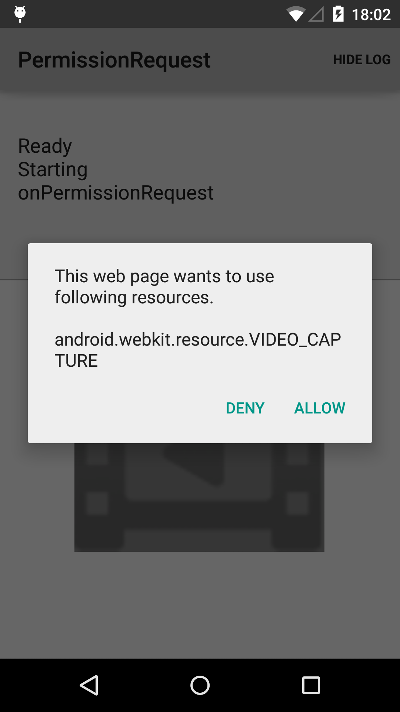
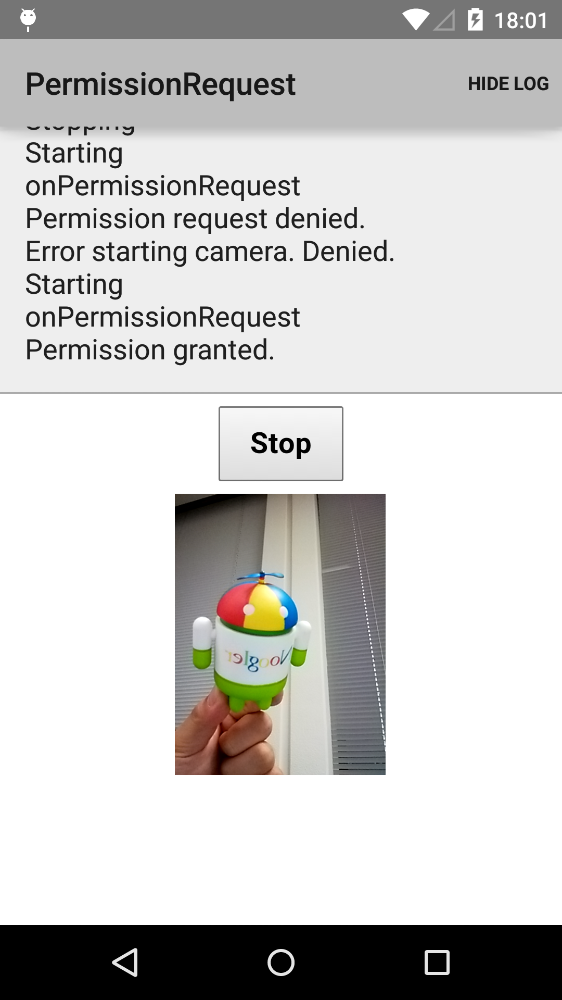

Android PermissionRequest Sample
===================================

This sample demonstrates how to use the PermissionRequest API to
securely provide access to restricted system features (such as a
camera or microphone) from within a WebView. In this example, a dialog
is created to allow users to explicitly approve or reject each
request.

Introduction
------------

PermissionRequest can be used by setting up a custom WebChromeClient.

```java
mWebView.setWebChromeClient(mWebChromeClient);
```

In you WebChromeClient implementation, you need to override
[onPermissionRequest][1]. This method is called when the web content
is requesting permission to access some resources, providing an
opportunity to approve or reject the request. In this implementation,
we display a dialog to allow the user to approve or reject any
request. In other applications, you may want to implement a whitelist
of allowed APIs.  Also, override [onPermissionRequestCanceled][2] for
handling cancellation of the PermissionRequest by the web content.

When the user confirms or denies the request, you can respond back to
the web content by [grant][3] or [deny][4] respectively.

```java
mPermissionRequest.grant(mPermissionRequest.getResources());
```

This sample provides the web content from the assets folder in the
app. Since WebView is not allowed to use getUserMedia from a "file://"
URL, the app uses the SimpleWebServer class to provide the content via
"http://localhost".

[1]: http://developer.android.com/reference/android/webkit/WebChromeClient.html#onPermissionRequest(android.webkit.PermissionRequest)
[2]: http://developer.android.com/reference/android/webkit/WebChromeClient.html#onPermissionRequestCanceled(android.webkit.PermissionRequest)
[3]: http://developer.android.com/reference/android/webkit/PermissionRequest.html#grant(java.lang.String[])
[4]: http://developer.android.com/reference/android/webkit/PermissionRequest.html#deny()

Pre-requisites
--------------

- Android SDK v23
- Android Build Tools v23.0.3
- Android Support Repository

Screenshots
-------------

  

Getting Started
---------------

This sample uses the Gradle build system. To build this project, use the
"gradlew build" command or use "Import Project" in Android Studio.

Support
-------

- Google+ Community: https://plus.google.com/communities/105153134372062985968
- Stack Overflow: http://stackoverflow.com/questions/tagged/android

If you've found an error in this sample, please file an issue:
https://github.com/googlesamples/android-PermissionRequest

Patches are encouraged, and may be submitted by forking this project and
submitting a pull request through GitHub. Please see CONTRIBUTING.md for more details.

License
-------

Copyright 2014 The Android Open Source Project, Inc.

Licensed to the Apache Software Foundation (ASF) under one or more contributor
license agreements.  See the NOTICE file distributed with this work for
additional information regarding copyright ownership.  The ASF licenses this
file to you under the Apache License, Version 2.0 (the "License"); you may not
use this file except in compliance with the License.  You may obtain a copy of
the License at

http://www.apache.org/licenses/LICENSE-2.0

Unless required by applicable law or agreed to in writing, software
distributed under the License is distributed on an "AS IS" BASIS, WITHOUT
WARRANTIES OR CONDITIONS OF ANY KIND, either express or implied.  See the
License for the specific language governing permissions and limitations under
the License.
